# Cafeteria

Cafeteria is a coffee lover's companion app designed to enhance the coffee experience. Users can browse different types of coffee, create personalized journal entries, and manage their profiles and carts. This app includes features for logging in, viewing products, tracking orders, and managing a coffee journal.

## Team Members
- XI XI
- YIXIANG ZHOU

## Features
1. **Authentication**: Sign up, log in, and reset password.
2. **Profile Management**: Edit profile details, including updating avatar and contact information.
3. **Coffee Exploration**: Browse through various coffee types and add them to the cart.
4. **Cart Management**: Add, remove, and adjust quantities of items in the cart, with a total price calculation.
5. **Journal**: Maintain a journal of coffee experiences with the option to add images and detailed notes.
6. **Notification**: Implemented by Xi Xi, users now receive push notifications for order updates, reminders for journal entries, and promotions.
7. **Location Use**: Implemented by YiXiang Zhou, location services were added to allow users to log coffee experiences with geographic data.
8. **Payment Integration**: YiXiang Zhou added a payment feature to facilitate checkout and order completion.
9. **About Us Page**: Created by YiXiang Zhou, this page provides app and team information.

## File Structure and Key Components
- **Signup.js**: Handles user sign-up, form validation, and navigation to the login screen if the user already has an account.
- **Login.js**: Provides login functionality with email and password validation, including navigation to the sign-up screen for new users.
- **Profile.js**: Displays user information with options for viewing order history, favorites, and updating account settings.
- **Journal.js**: Main journal page, displaying entries filtered by the user's ID. Includes a search bar and profile statistics.
- **JournalDetail.js**: Displays details of a single journal entry. Options for editing or deleting entries.
- **Home.js**: Main screen with categories of coffee, including search and category-based filtering.
- **AddJournal.js**: Allows users to create new journal entries with images and descriptive text.
- **Cart.js**: Displays items in the cart, allows quantity adjustments, and calculates the total price.
- **EditProfile.js**: Allows users to edit profile details, including name, phone, and address, and update the avatar.
- **NotificationManager.js**: Implements reminders for users to buy coffee at a fixed time each day.
- **Payment.js**: Handles checkout functionality with payment confirmation.
- **About.js**: Displays app and team information.

## Firestore Collections and Data Model
- **users**: Stores user profile details (e.g., email, username, avatar).
- **cart**: Manages items added to the cart by users, with fields for item details and quantities.
- **journals**: Holds user journal entries, including title, content, and image URL.

### Example Data Models
- **User Profile**
  ```json
  {
    "displayName": "John Doe",
    "email": "johndoe@example.com",
    "phone": "123-456-7890",
    "address": "123 Coffee St.",
    "imageUri": "file:///path/to/avatar.jpg",
    "userId": "user123"
  }
  ```
- **Journal Entry**
  ```json
  {
    "title": "My First Espresso",
    "content": "Loved the richness of the espresso. Perfect start to the day!",
    "date": "2024-11-12T10:01:19.000Z",
    "imageUri": "file:///path/to/image.jpg",
    "userId": "user123"
  }
  ```
- **Cart Item**
  ```json
  {
    "userId": "user123",
    "id": "coffee123",
    "name": "Espresso",
    "imageUri": "file:///path/to/coffee.jpg",
    "price": 4.99,
    "quantity": 2
  }
  ```

## CRUD Operations
- **Authentication**: Uses Firebase Authentication for login and sign-up.
- **Database**: Firebase Firestore stores data for user profiles, cart items, and journal entries.

| Collection | Operations |
|------------|------------|
| `users`    | `createUserProfile`, `fetchUserProfile`, `updateUserProfile` |
| `cart`     | `fetchCartItems`, `addOrUpdateCartItem`, `deleteCartItem` |
| `journals` | `fetchJournals`, `addJournalEntry`, `deleteJournalEntry` |

## Firebase Security Rules
```javascript
rules_version = '2';
service cloud.firestore {
  match /databases/{database}/documents {
    match /users/{document=**} {
      allow read, write: if request.auth != null && request.auth.uid == resource.data.userId;
    }
    match /cart/{document=**} {
      allow read, write: if request.auth != null && request.auth.uid == resource.data.userId;
    }
    match /journals/{document=**} {
      allow read, write: if request.auth != null && request.auth.uid == resource.data.userId;
    }
  }
}
```

## Contributions
- **YiXiang Zhou**
  - Set up app navigation and overall structure.
  - Implemented authentication and CRUD operations for Firestore.
  - Developed Home Login, Signup, Profile, and Edit Profile screens.
  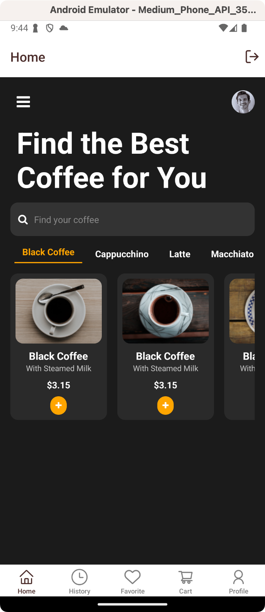
  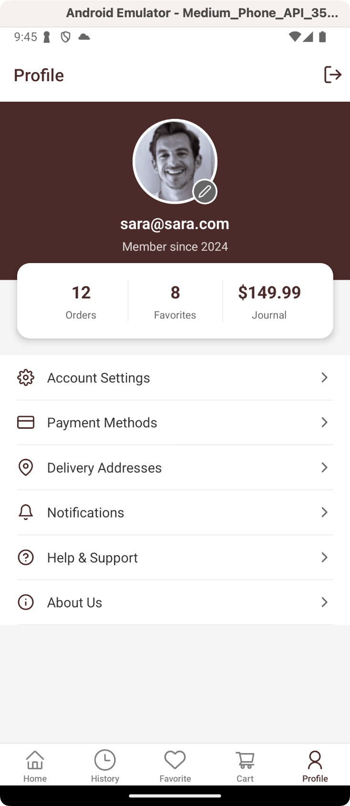
  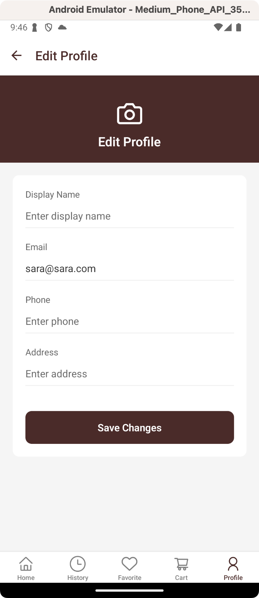
  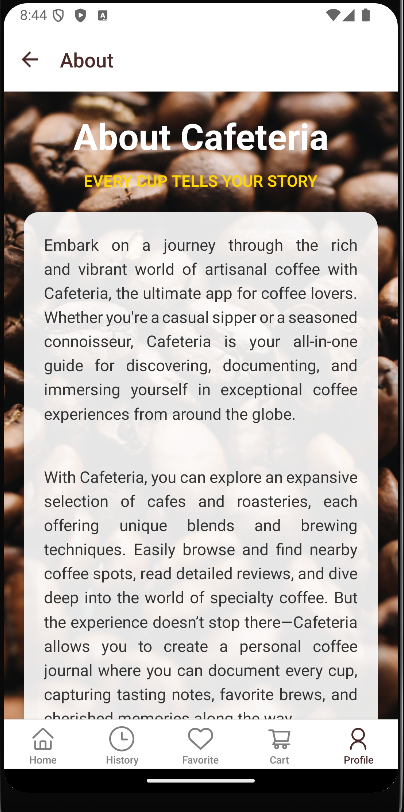
  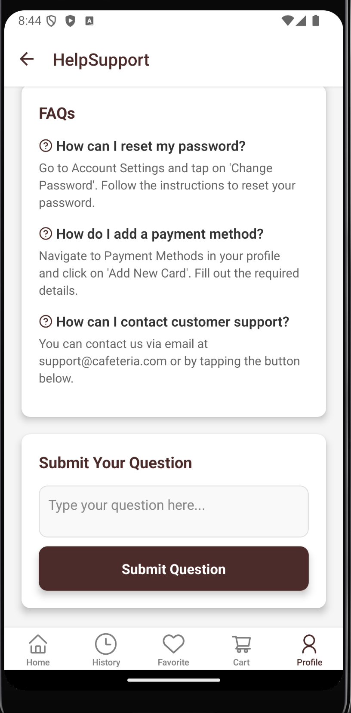
  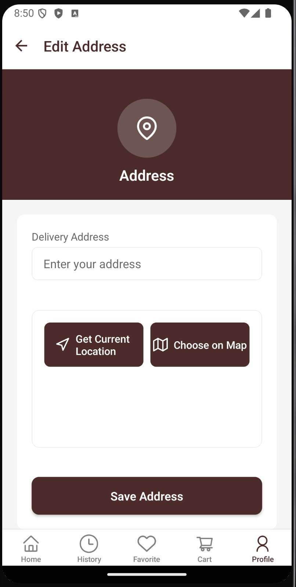
  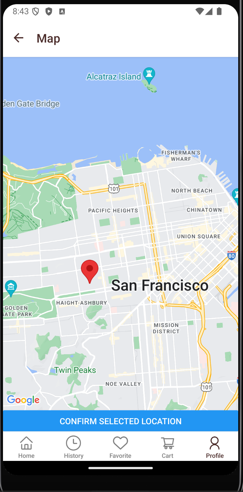
  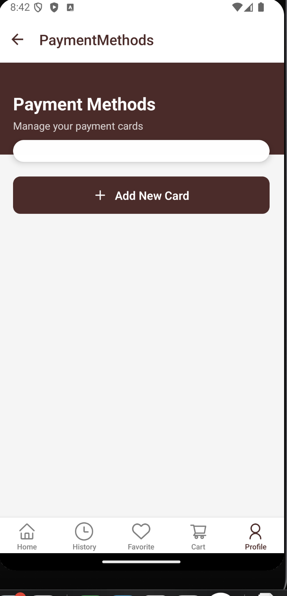
  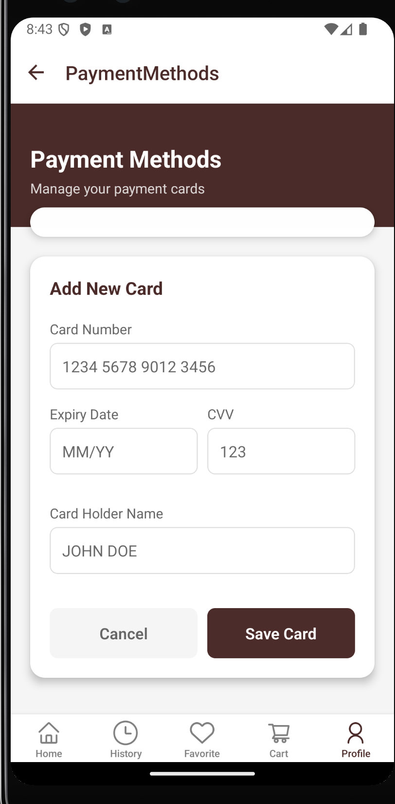
  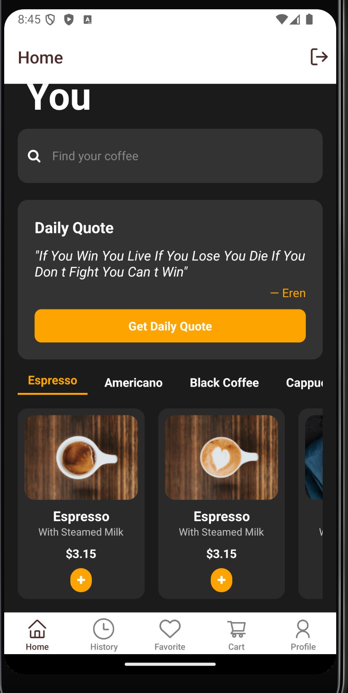
- **Xi Xi**
  - Set up app navigation and overall structure.
  - Developed Home, Cart, Journal, Add Journal and Journal Detail screens.
  - Integrated Firestore interactions in the Cart and Journal sections.
  - Created README documentation.
  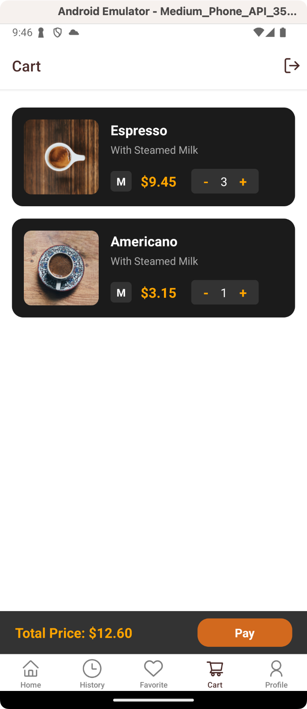
  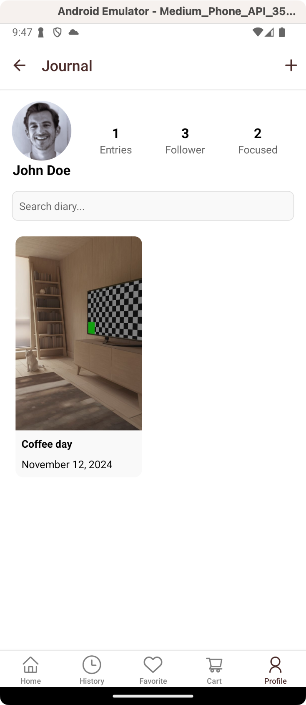
  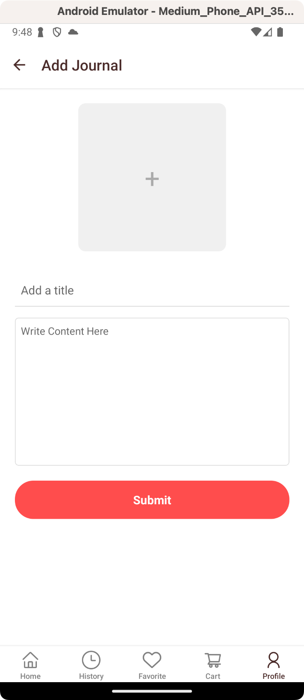
  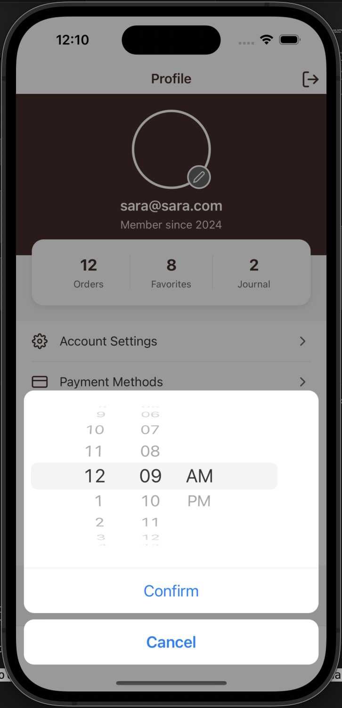
  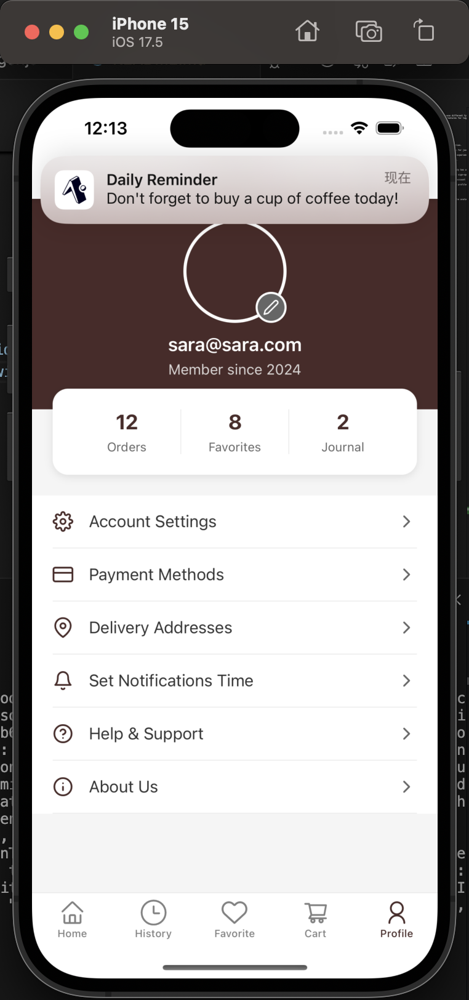
  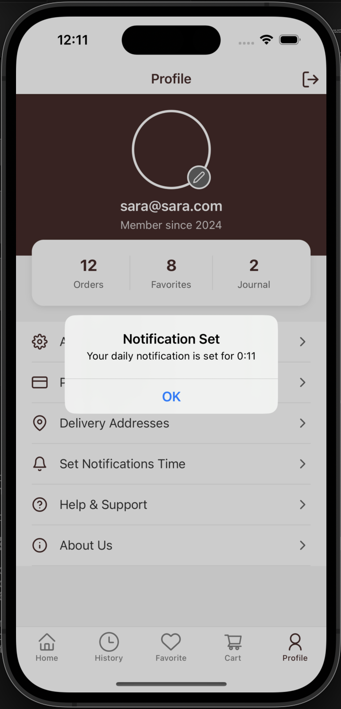
